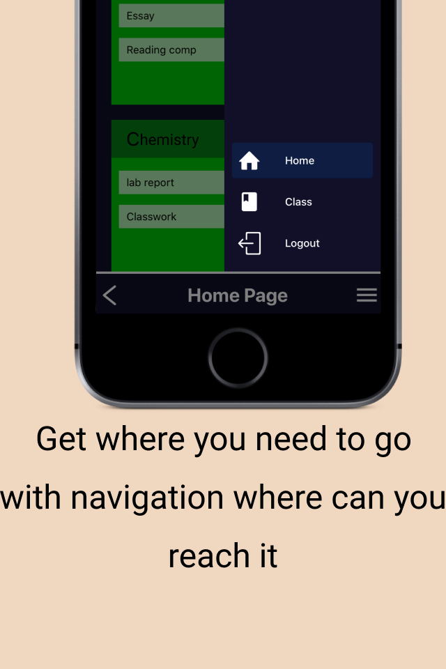

## **Classy**

### _One_ place for all your assignments

In its current state, Classy is only an MVP (Minimum Viable Product) with no _real_ data imported from the actual user or _real_ login. Classy gives you a versatile and convenient place for you to access assignments, from a variety of platforms, and submit them in one, simple, clean environment. By eliminating the complication of switching between apps constantly Classy helps you save time and keep your focus. With customizable notifications, you can know the second your grade drops or a new assignment is released. With Classy's grade calculator you can see what you need to make on your future assignments to get a specific grade. The main purpose of this app was for me to learn a little bit of all aspects of mobile app development but maybe one-day Classy will be completed.

#### Features
- [ ] get and submit classwork, quizzes, or tests
- [ ] imports from all your classes, from Canvas to Blackboard
- [ ] login with your own email and password or with Google

